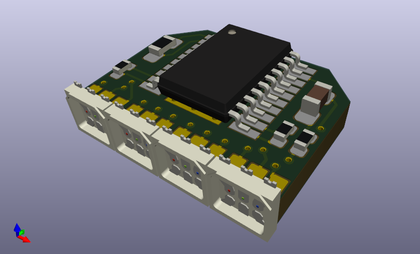

<!--lint disable maximum-line-length-->
<!--lint disable list-item-spacing-->
<!--lint disable list-item-indent-->

# LED-Board 1x4 16bit high density


a LED Board that can be combined seamlessly to bigger lines with very high LED density (= small pixel-pitch).  
It uses the [TI TLC5971](http://www.ti.com/product/TLC5971) Constant-Current LED-Driver Chip with 16bit dimming resolution (HTSSOP-20 housing).  
The LED-Type used is [Nichia NSSM124D](http://www.nichia.co.jp/en/product/led_product_data.html?type=%27NSSM124D%27) - these are [available as cut-tape from an distributor](http://www.leds.de/en/Ordinary-LEDs/SMD-LEDs/Nichia-SMD-LED-RGB-NSSM124DT.html).

The thing is designed to be hand-soldered.

## Project-Status
- design phase

### TODO
- fix pads that are to small for hand-soldering
- order updated PCB's
- solder some more boards


## Technical Information
every controller chip (TLC5971) has 12 ConstantCurrent outputs. so every LED is controllable individual.

### HW
- PCB size: 12 x 8 x 3.3mm
- pixel-pitch: 3.1mm
- 3.8V..5.5V
- <= 0.25A (maximum)

<!--
### BOM
there is the raw exported BOM at [export/BOM/LEDBoard_4x4_16bit_BOM.csv](export/BOM/LEDBoard_4x4_16bit_BOM.csv) and an modified LibreOffice Calc file with ordering and Price calculations at [doc/LEDBoard_4x4_16bit_PriceCalculation_Ordering](doc/LEDBoard_4x4_16bit_PriceCalculation_Ordering.csv) (link points to exported csv as preview) -->

### controlling

see [LEDBoard_4x4_16bit](https://github.com/s-light/LEDBoard_4x4_16bit) for more Information

## KiCad Version
```text
Application: kicad
Version: 5.0.0-fee4fd1~66~ubuntu18.04.1, release build
Libraries:
    wxWidgets 3.0.4
    libcurl/7.58.0 OpenSSL/1.1.0g zlib/1.2.11 libidn2/2.0.4 libpsl/0.19.1 (+libidn2/2.0.4) nghttp2/1.30.0 librtmp/2.3
Platform: Linux 4.15.0-36-generic x86_64, 64 bit, Little endian, wxGTK
Build Info:
    wxWidgets: 3.0.4 (wchar_t,wx containers,compatible with 2.8) GTK+ 2.24
    Boost: 1.65.1
    OpenCASCADE Community Edition: 6.9.1
    Curl: 7.58.0
    Compiler: GCC 7.3.0 with C++ ABI 1011

Build settings:
    USE_WX_GRAPHICS_CONTEXT=OFF
    USE_WX_OVERLAY=OFF
    KICAD_SCRIPTING=ON
    KICAD_SCRIPTING_MODULES=ON
    KICAD_SCRIPTING_WXPYTHON=OFF
    KICAD_SCRIPTING_ACTION_MENU=ON
    BUILD_GITHUB_PLUGIN=ON
    KICAD_USE_OCE=ON
    KICAD_USE_OCC=OFF
    KICAD_SPICE=ON
```

## License
<!-- License info -->
<a rel="license" href="http://creativecommons.org/licenses/by/4.0/">
    
</a><br />
<span xmlns:dct="http://purl.org/dc/terms/" property="dct:title">
    LEDBoard_1x4_16bit_highdensity
</span>
by
<a xmlns:cc="http://creativecommons.org/ns#" href="https://github.com/s-light/LEDBoard_4x4_16bit" property="cc:attributionName" rel="cc:attributionURL">
    Stefan Krüger (s-light)
</a>
is licensed under a
<a rel="license" href="http://creativecommons.org/licenses/by/4.0/">
    Creative Commons Attribution 4.0 International License
</a>.
